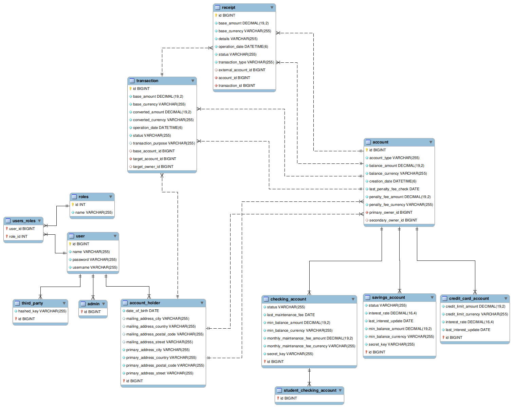

# IH-Midterm-Project-Banking-System

Ironhack Bootcamp Midterm Project: Banking System

## Goals

The main purpose of this project is to create a functional banking system java application. Has a sum up of the
requirements, the project must:

- Have a variety of account types: Checking Account, Student Checking Account, Savings Account, and Credit Card;
- Be accessible for 3 types of users: Admin, Account Holder, and Third Parties;
- Be protected for each type of user;
- Allow the users to manage their accounts and create transactions between accounts, for account holders and third
  parties;
- Manage automatically some specific account functions:
    - Verify fraudulent transactions;
    - Add interest to savings accounts and credit cards;
    - Withdraw maintenance and penalty fees.

## The Project

### Functionality

The program works correctly and it implements its goal.

It allows for the creation of account holders, admins, and third parties, adn for the creation of multiple accounts:
checking, student checking, savings, credit card. The transactions are saved in a transaction model and in a receipt
model to be easier to read.  
For account management, it automatically adds interest on the correct dates (1 per month for credit card, and 1 per year
for savings account), it withdraws penalty fees when the account is bellow the minimum amount, and it withdraws
maintenance fees every month for checking accounts. Additional it checks each transaction for unusual behaviour, such as
fast sequence of transactions or suspicious large transactions, and it will freeze the account for security reasons.

### Set up

Before running the program a database and a user must be created. The database in use is from MySQL. To create the
database and user, it is possible to modify the application.properties files, or use the following queries:

#### Main program

```
CREATE DATABASE IF NOT EXISTS BankingSystem;
CREATE USER IF NOT EXISTS 'user'@'localhost' IDENTIFIED BY 'User-123';
GRANT ALL PRIVILEGES ON BankingSystem.* TO 'user'@'localhost';
FLUSH PRIVILEGES;
```

#### Dev and Testing program

```
CREATE DATABASE IF NOT EXISTS BankingSystem_dev;
CREATE DATABASE IF NOT EXISTS BankingSystem_test;
CREATE USER IF NOT EXISTS 'dev'@'localhost' IDENTIFIED BY 'Development-123';
GRANT ALL PRIVILEGES ON BankingSystem_dev.* TO 'dev'@'localhost';
GRANT ALL PRIVILEGES ON BankingSystem_test.* TO 'dev'@'localhost';
FLUSH PRIVILEGES;
```

### Endpoints

#### Users

#### Accounts

#### Transactions

### Testing

For the unit testing it was used Jacoco and Mockito to optimize the process.

For the manual integration testing it was used Postman. All the examples and Postman testing was saved and can be
accessed [here](extras/postman/%5BJoão%20Afonso%5D%20Midterm%20-%20Manual%20Testing.postman_collection.json). (import to
postman)

### Diagrams

#### UML Class Diagram



#### UML Class Diagram


#### SQL Relations Diagram


## Notes

## Next Steps


